# SOC168 - Whoami Command Detected in Request Body
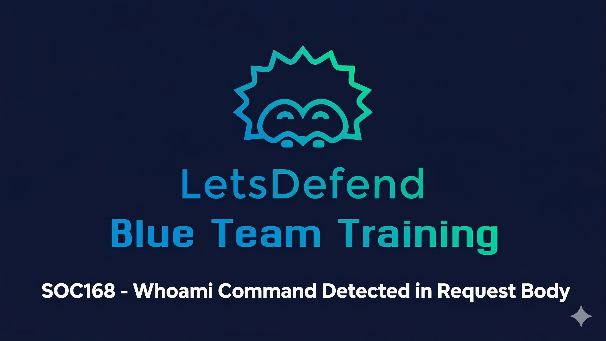

**Web Application Command Injection Investigation & Endpoint Containment | LetsDefend Platform**

[](https://app.letsdefend.io/)
[](#)
[](#)
[](#)

---

## 🎯 Case Overview

**Case ID:** SOC168  
**Alert Type:** Whoami Command Detected in Request Body  
**Date:** February 28, 2022, 04:12 AM  
**Severity:** High  
**Verdict:** True Positive — Command Injection Attack Confirmed

**Executive Summary:**

Investigated a confirmed web application command injection attack against an internal web server (`WebServer1004`) originating from a malicious IP in China (`61.177.172.87`). The attacker successfully injected Linux system commands — `whoami`, `ls`, `uname`, `/etc/passwd`, and `/etc/shadow` — through POST request parameters. All 5 injection attempts returned HTTP `200 OK` with varying response sizes, confirming successful execution. The compromised endpoint was identified, isolated, and escalated to L2 for further analysis.

---

## 📊 Attack Chain Analysis

**Attack Stages:**
```
1. External Reconnaissance
   └─ Attacker IP: 61.177.172.87 (CHINANET-JS, China)
   └─ Target: 172.16.17.16 (WebServer1004)

2. Command Injection via POST Parameters
   └─ URL: hxxps://172.16.17.16/video
   └─ Commands injected: whoami, ls, uname, /etc/passwd, /etc/shadow

3. Successful Execution (HTTP 200 OK × 5)
   └─ All 5 injection attempts returned 200 OK
   └─ Varying response sizes confirm command output returned

4. Privilege & System Enumeration
   └─ whoami → identifies current user and privilege level
   └─ ls → directory traversal, file listing
   └─ uname → OS and kernel version enumeration
   └─ /etc/passwd → system user enumeration
   └─ /etc/shadow → encrypted password hash extraction

5. Credential Theft
   └─ /etc/shadow accessed — hashed passwords exposed (possibility)
   └─ Brute-force attack possible against extracted hashes

6. Endpoint Containment
   └─ WebServer1004 isolated from network
   └─ Ticket escalated to L2 Analyst
```

---

## 🔍 Investigation Methodology

### Phase 1: Initial Alert Triage

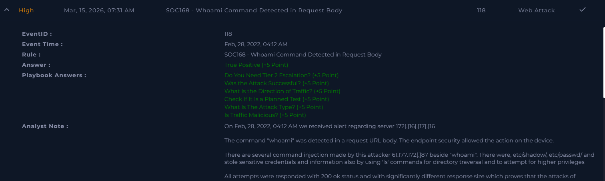

**Alert Details:**

| Field | Value | Notes |
|-------|-------|-------|
| **Alert Name** | Whoami Command Detected in Request Body | Web application attack vector |
| **Date** | Feb 28, 2022, 04:12 AM | Off-hours — consistent with automated attack |
| **Target Host** | WebServer1004 | Internal web server |
| **Destination IP** | 172.16.17.16 | Internal web server IP |
| **Source IP** | 61.177.172.87 | External — China-based attacker |
| **Request URL** | hxxps://172.16.17.16/video | Injection point in web application |
| **Action Taken by Endpoint** | Allowed | Injection was not blocked — critical finding |

---

### Phase 2: IP Reputation Analysis

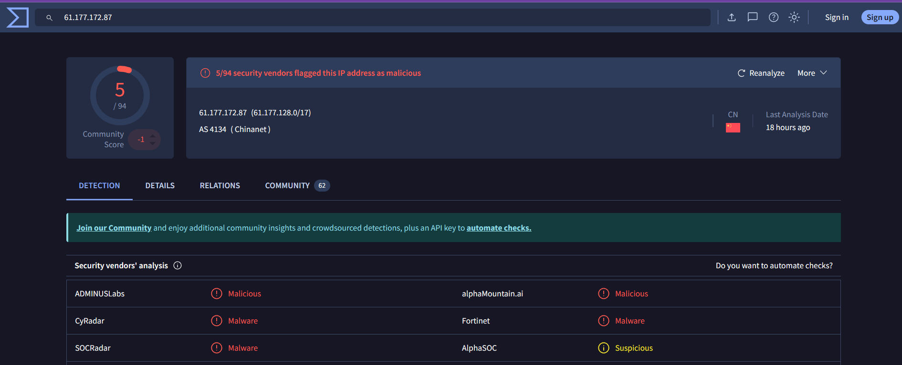

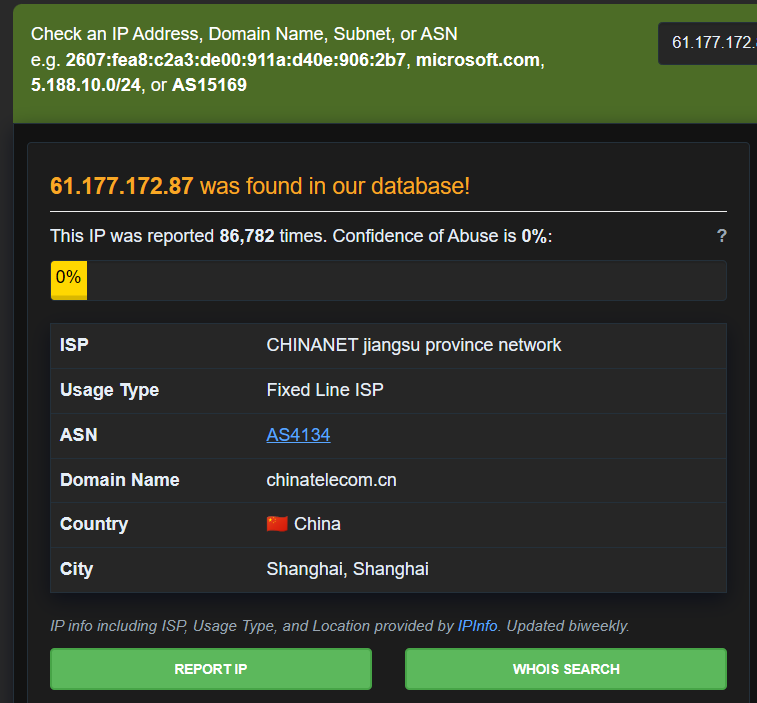

**Attacker IP Intelligence:**

| Source | Finding | Risk |
|--------|---------|------|
| **VirusTotal** | 5/94 security vendors flagged as malicious | ⚠️ Confirmed malicious |
| **AbuseIPDB** | Reported **86,782 times** by the community | 🔴 High confidence malicious |
| **ISP** | CHINANET jiangsu province network — `CHINANET-JS` | External, non-trusted |
| **Hostname** | chinatelecom.cn | External Chinese ISP |
| **Origin** | China | Confirms external, non-internal attack |

**Verdict:** Traffic is definitively **external and malicious**. IP has a well-established history of abuse across the security community.

---

### Phase 3: Log Analysis — Command Injection Evidence
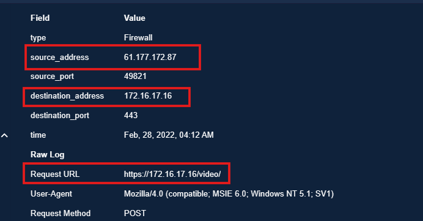
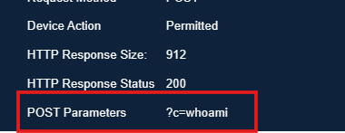
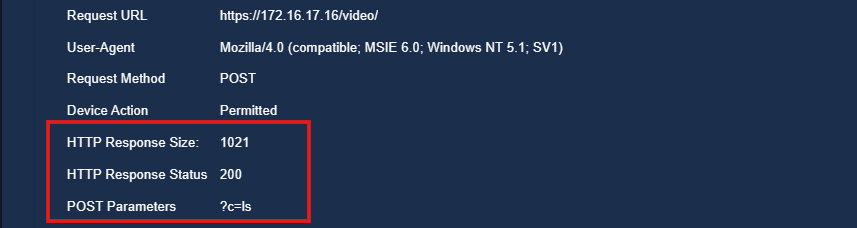
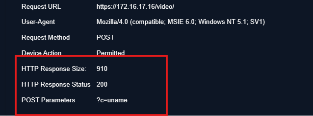
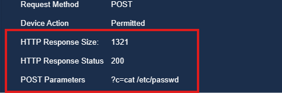
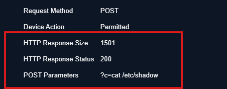

**5 Malicious POST Requests Identified:**

| # | Command Injected | Purpose | HTTP Status | Outcome |
|---|-----------------|---------|-------------|---------|
| 1 | `whoami` | Identify current user and privilege level | 200 OK | ✅ Executed |
| 2 | `ls` | List directory contents — reconnaissance | 200 OK | ✅ Executed |
| 3 | `uname` | Extract OS name, kernel version, architecture | 200 OK | ✅ Executed |
| 4 | `/etc/passwd` | Dump system user accounts | 200 OK | ✅ Executed |
| 5 | `/etc/shadow` | Extract encrypted password hashes | 200 OK | ✅ Executed |

> All 5 requests returned **HTTP 200 OK** with **significantly different response sizes** — confirming that each command executed successfully and returned output to the attacker.

**Understanding Each Injected Command:**

- **`whoami`** — Displays the current user running the web process. Attackers use this to determine privilege level (e.g., root vs. www-data) and decide how aggressively to escalate.
- **`ls`** — Lists files and directories. Enables the attacker to map the server's file structure and identify sensitive files for further targeting.
- **`uname`** — Equivalent to `systeminfo` on Windows. Returns the OS name, kernel version, and architecture — used to identify exploitable vulnerabilities specific to that version.
- **`/etc/passwd`** — Stores all system user accounts and their metadata. Exposes every user on the system, including service accounts.
- **`/etc/shadow`** — Stores encrypted (hashed) passwords for all user accounts. If exfiltrated, an attacker can run offline brute-force or dictionary attacks to crack the passwords.

---

### Phase 4: Endpoint Investigation


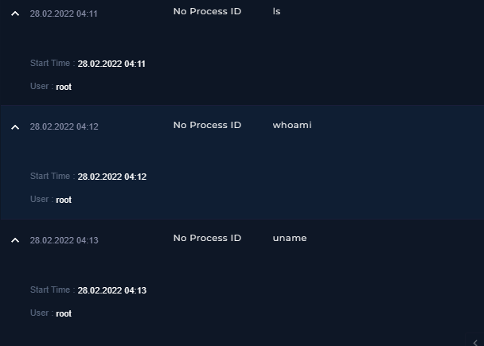
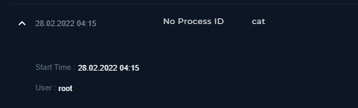

**Compromised Endpoint Details:**

| Property | Value |
|----------|-------|
| **Hostname** | WebServer1004 |
| **IP Address** | 172.16.17.16 |
| **Server Role** | Web Server |
| **Status** | ⛔ Compromised — Contained |

**Terminal History Confirmation:**

The same commands injected via POST parameters — `whoami`, `ls`, `uname`, `cat /etc/passwd`, `cat /etc/shadow` — were found in the **terminal history of WebServer1004**, confirming that the injected commands were not just received but fully executed on the operating system level.

**Evidence of Compromise:**
- ✅ Command injection via POST parameters confirmed in raw logs
- ✅ All 5 injections returned HTTP 200 OK — execution confirmed
- ✅ Same commands found in WebServer1004 terminal/CMD history
- ✅ Attacker IP (61.177.172.87) confirmed malicious via VirusTotal + AbuseIPDB
- ✅ Traffic originated from outside (Internet) — not internal

---

### Phase 5: Containment & Escalation

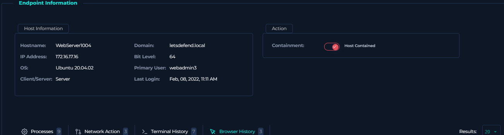
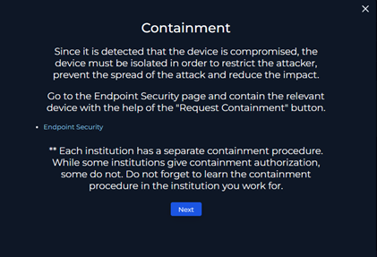

**Actions Taken:**

✅ **WebServer1004 Isolated** — Removed from network to prevent lateral movement and further data exfiltration

✅ **Ticket Escalated to L2 Analyst** — Case handed off for deeper forensic investigation and full scope assessment

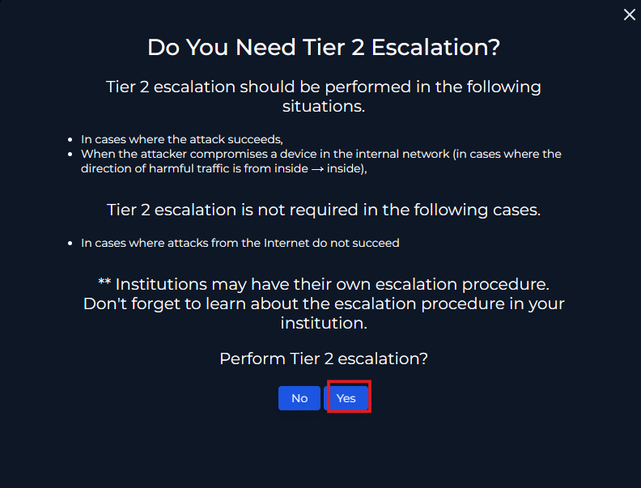

✅ **Attack Classified as External & Unplanned** — Confirmed not a planned internal test; external malicious actor

---

## 🧠 Technical Deep Dive

### Understanding Command Injection

**What Is Command Injection?**
Command injection is a critical web application vulnerability (OWASP Top 10 — A03: Injection) where an attacker inserts operating system commands into an input field that is passed directly to the server's shell without proper sanitization.

```
Normal Request:
POST /video HTTP/1.1
parameter=normalvalue

Malicious Request:
POST /video HTTP/1.1
parameter=; whoami
parameter=; cat /etc/shadow
```

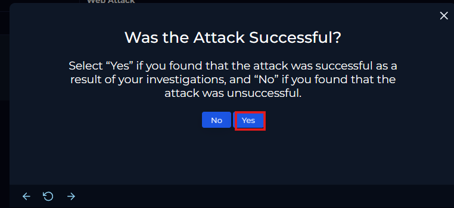


**Why This Succeeded:**
```
1. Web application accepts user input in POST body
2. Input is NOT sanitized or validated server-side
3. Application passes input directly to OS shell
4. OS executes the injected command
5. Output returned to attacker in HTTP response body
```

**Why HTTP 200 OK is Critical Evidence:**

A 200 OK response does not just mean "request received" — in this context it means:
- The server processed the request successfully
- The command was executed
- Output was returned in the response body
- The varying response sizes confirm different amounts of data were sent back per command

---

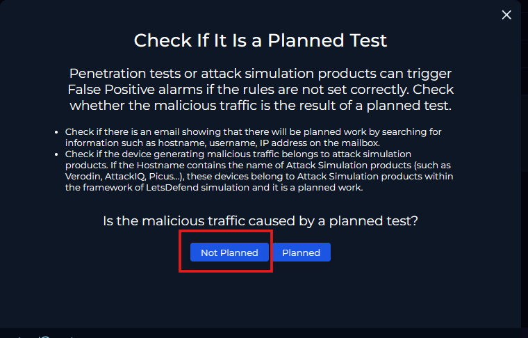
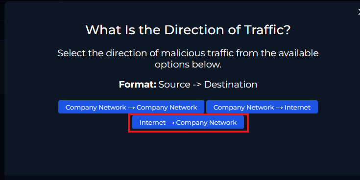

## 📋 Investigation Summary
### Attack Timeline
```
Feb 28, 2022
04:12 AM — Alert triggered: "Whoami Command Detected in Request Body"
04:12 AM — Source IP 61.177.172.87 sends POST to hxxps://172.16.17.16/video
           └─ Injection 1: whoami → 200 OK
           └─ Injection 2: ls → 200 OK
           └─ Injection 3: uname → 200 OK
           └─ Injection 4: /etc/passwd → 200 OK
           └─ Injection 5: /etc/shadow → 200 OK
XX:XX AM — SOC analyst begins investigation
XX:XX AM — IP reputation confirmed malicious (VirusTotal + AbuseIPDB)
XX:XX AM — Raw logs reviewed — 5 successful command injections confirmed
XX:XX AM — WebServer1004 terminal history examined — execution confirmed
XX:XX AM — WebServer1004 isolated via Endpoint Management
XX:XX AM — Case escalated to L2 Analyst
XX:XX AM — Case closed: True Positive — Active Command Injection Attack
```
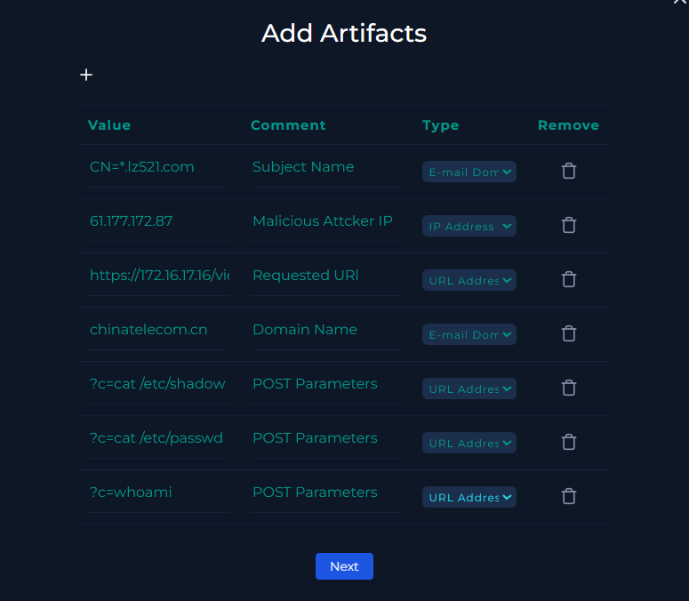
### Indicators of Compromise (IOCs)

**Network Indicators:**
```
Attacker IP:    61.177.172[.]87  (CHINANET-JS, China)
Target IP:      172.16.17[.]16   (WebServer1004 — Internal)
Target Hostname: chinatelecom.cn (attacker's hostname)
Request URL:    hxxps://172.16.17.16/video
```

**Host Indicators:**
```
Compromised Host:  WebServer1004 (172.16.17.16)
Injected Commands: whoami, ls, uname, /etc/passwd, /etc/shadow
HTTP Method:       POST
Response Code:     200 OK (×5 — all successful)
Evidence:          Terminal history matches injected commands
```

---

## 🎯 Remediation Actions Taken

### Immediate Response

✅ **Endpoint Containment**
- WebServer1004 isolated from the network via Endpoint Management
- Prevented lateral movement to other internal systems
- Further exfiltration of credentials blocked post-containment

✅ **Escalation**
- Ticket escalated to L2 Analyst for full forensic investigation
- Evidence preserved: raw logs, terminal history, IP reputation reports

### Recommended Follow-Up Actions

✅ **Credential Reset**
- All user credentials on WebServer1004 must be considered compromised
- `/etc/shadow` was accessed — all hashed passwords should be treated as exposed
- Implement strong passwords with automatic expiration on breach detection

✅ **System Hardening**
- Patch the web application — sanitize and validate all POST parameter inputs
- Implement Web Application Firewall (WAF) rules to block OS command patterns
- Apply principle of least privilege — web process should not run as root

✅ **Privilege Review**
- Reset all privileges on WebServer1004 based on compliance requirements
- Audit all service accounts exposed via `/etc/passwd`
- Remove any unauthorized accounts created during the attack window

---

## 💼 Skills Demonstrated

### Security Operations

✅ **Alert Triage**
- Assessed SOC168 alert within the LetsDefend SIEM environment
- Identified attack type, source, target, and initial severity immediately

✅ **IP Reputation Analysis**
- Cross-referenced attacker IP against VirusTotal (5/94 flags) and AbuseIPDB (86,782 reports)
- Confirmed external origin and non-planned nature of the attack

✅ **Web Application Attack Analysis**
- Identified command injection via POST parameters as the attack vector
- Analyzed 5 raw HTTP logs — correlated HTTP 200 OK with successful command execution
- Understood significance of varying response sizes as proof of output return

### Technical Analysis

✅ **Log Correlation**
- Cross-referenced SIEM alerts with raw log entries and endpoint terminal history
- Confirmed command execution by matching POST parameters to WebServer1004 CMD history

✅ **Endpoint Investigation**
- Searched WebServer1004 in Endpoint Management
- Reviewed terminal history to validate server-side execution of injected commands

✅ **Incident Containment**
- Isolated compromised endpoint via Endpoint Management to stop lateral movement
- Escalated case correctly to L2 following SOC playbook

---

## 🛠️ Tools & Technologies Used

| Category | Tools |
|----------|-------|
| **Investigation Platform** | LetsDefend SOC Simulator |
| **IP Reputation** | VirusTotal, AbuseIPDB |
| **Log Analysis** | LetsDefend Log Management Console |
| **Endpoint Security** | LetsDefend EDR — Terminal History & Containment |
| **Alert Management** | LetsDefend SIEM Alert Queue |

---

## 📚 Learning Outcomes

1. **Command Injection (OWASP A03)**
   - How unsanitized POST parameters enable OS command execution
   - Why HTTP 200 OK + variable response sizes confirm successful injection
   - The escalation path from `whoami` → `ls` → `/etc/shadow` in a real attack

2. **Linux Command Abuse in Attacks**
   - How attackers use native Linux commands for reconnaissance instead of malware
   - The risk of `/etc/shadow` access and offline password cracking

3. **IP Threat Intelligence**
   - Cross-referencing VirusTotal and AbuseIPDB for attacker context
   - How ISP and geolocation data helps confirm external vs. internal origin

4. **SOC Analyst Workflow**
   - Alert triage → IP analysis → log review → endpoint investigation → containment → escalation
   - When and how to escalate to L2 within the incident response lifecycle

---

## 📖 Case Documentation

**Platform:** LetsDefend  
**Case Number:** SOC168  
**Alert Date:** February 28, 2022, 04:12 AM  
**Analyst:** Kanhay Thakore  
**Verdict:** ✅ True Positive  
**Status:** Closed — Endpoint Contained & Escalated to L2

---

## 📧 Contact

**Kanhay Thakore**  
SOC Analyst | Web Application Security | Threat Detection | Incident Response

[](https://www.linkedin.com/in/kanhaythakore/)
[](mailto:thakorekanhay70@gmail.com)

---

## 📄 Disclaimer

This case was investigated on the LetsDefend training platform as part of cybersecurity education. All indicators, IOCs, and artifacts are from a simulated SOC environment. No real organizations or systems were compromised.

---

⭐ **If you found this case analysis valuable, please give it a star!**

*Last Updated: 2026*
